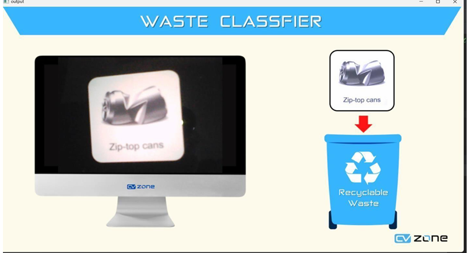
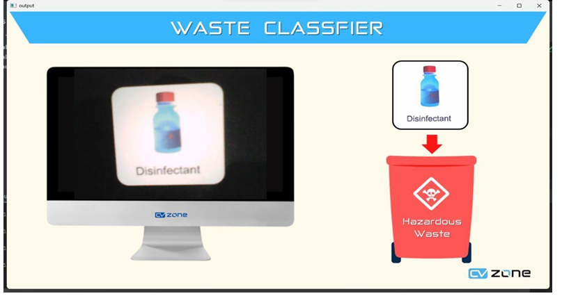
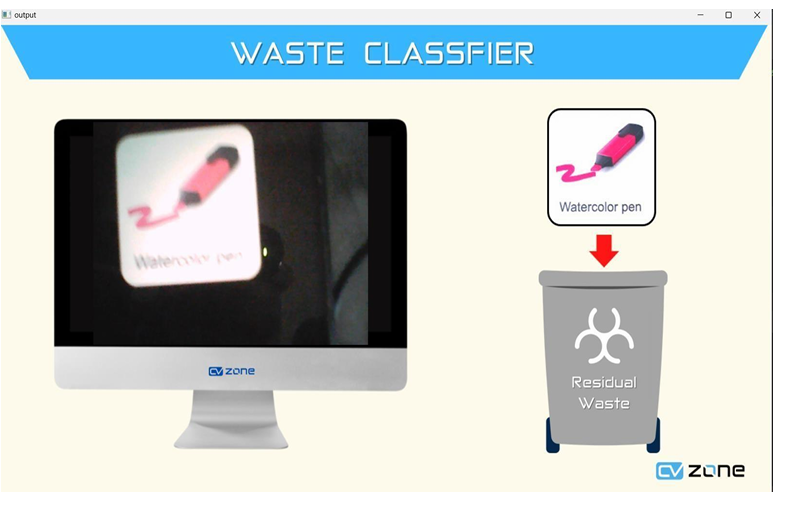

# Smart Waste Management System

Welcome to the **Smart Waste Management System**! This project leverages advanced machine learning techniques, including **Convolutional Neural Networks (CNNs)** and **Autoencoders**, to classify waste into three categories and detect anomalies in waste images.

## 🚀 Features

- **Waste Classification:** Classifies waste into three categories:
  1. **Recyclable**
  2. **Hazardous**
  3. **Residual**
- **Anomaly Detection:** Identifies anomalies in waste images for better sorting and management.
- **Visualization:** Outputs classification results as image files for easy interpretation.

## 📁 Project Structure

```
Smart_Waste_Management_System/
|— notebooks/
|   |-- train_cnn.ipynb
|   |-- train_autoencoder.ipynb
|— data/
|   |-- train/
|   |-- validation/
|   |-- test/
|— models/
|   |-- cnn_model.h5
|   |-- autoencoder_model.h5
|— outputs/
|   |-- classifications/
|   |-- anomalies/
|— requirements.txt
|— README.md
```

## 🛠 Requirements

- Python 3.x
- TensorFlow
- scikit-learn
- matplotlib
- transformers
- Pillow

## 💾 Installation

1. **Clone the repository:**
   ```sh
   git clone https://github.com/yourusername/Smart_Waste_Management_System.git
   cd Smart_Waste_Management_System
   ```

2. **Install the dependencies:**
   ```sh
   pip install -r requirements.txt
   ```

## 🧑‍💻 Usage

### 1. Dataset Preparation
- Place your dataset in the `data/` directory.
- Update the `dataset_dir` variable in the notebook with the path to your dataset.

### 2. Training the CNN Model
The CNN model is trained to classify waste images into three categories:
- **Recyclable**
- **Hazardous**
- **Residual**

The trained model is saved as `cnn_model.h5` in the `models/` directory.

### 3. Feature Extraction
Features are extracted from the trained CNN model for both training and validation datasets.

### 4. Training the Autoencoder
An autoencoder is built and trained using the extracted features to detect anomalies in waste images.

### 5. Anomaly Detection
The trained autoencoder is used to detect anomalies in the test dataset.

### 6. Visualization
The classification results and anomaly detections are saved as images in the `outputs/` directory.

## 📖 Notebook Workflow

1. **Imports:** Load the necessary libraries and modules.
2. **Dataset Path and Image Size:** Define the dataset path and categories.
3. **Model Training:** Train the CNN model on the training dataset.
4. **Feature Extraction:** Extract features using the trained CNN model.
5. **Autoencoder Training:** Train the autoencoder using extracted features.
6. **Anomaly Detection:** Detect anomalies using the trained autoencoder.
7. **Evaluation:** Evaluate model performance using confusion matrices and classification reports.

## 🖼 Example Code

```python
# Train CNN model
cnn_model = build_cnn_model()
cnn_history = cnn_model.fit(
    train_generator,
    epochs=50,
    validation_data=validation_generator,
    callbacks=[lr_scheduler, early_stopping]
)
cnn_model.save('models/cnn_model.h5')

# Extract features
train_features = prepare_autoencoder_data(train_generator, cnn_model)
validation_features = prepare_autoencoder_data(validation_generator, cnn_model)

# Build and train the autoencoder
autoencoder = build_autoencoder(train_features.shape[1])
autoencoder_history = train_autoencoder(autoencoder, train_features, validation_features)

# Detect anomalies on new data
test_generator = datagen.flow_from_directory(
    'data/test/',
    target_size=(image_size, image_size),
    batch_size=batch_size,
    class_mode='categorical'
)
```

## 🏆 Output Example

- **Classification Results:** Each classified waste image is saved with its predicted label (Recyclable, Hazardous, or Residual).
- **Recyclable**
- ## 
- **Hazardous**
- ## 
- **Residual**
- ## 
- **Anomaly Detection Results:** Images with detected anomalies are highlighted and saved in the `outputs/anomalies/` directory.

## 🤝 Contributing

We welcome contributions to improve this project! Feel free to open issues or submit pull requests on [GitHub](https://github.com/yourusername/Smart_Waste_Management_System).

## 📜 License

This project is licensed under the MIT License.

## 🌟 Acknowledgments

Thanks to all contributors and the open-source community for their support!

---

Happy coding and let’s make waste management smarter and more sustainable! ♻️

